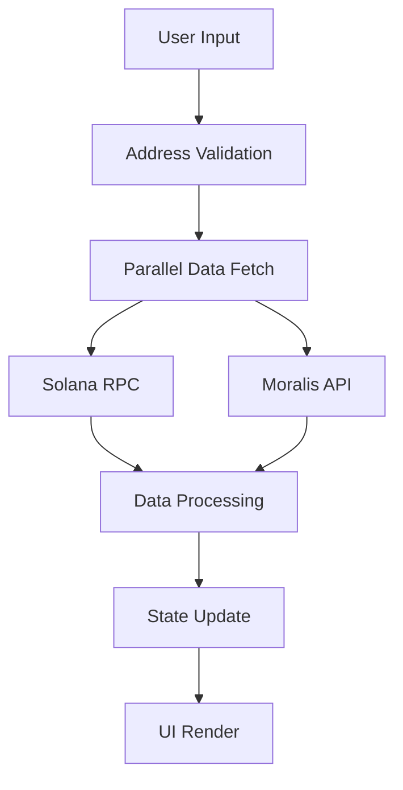
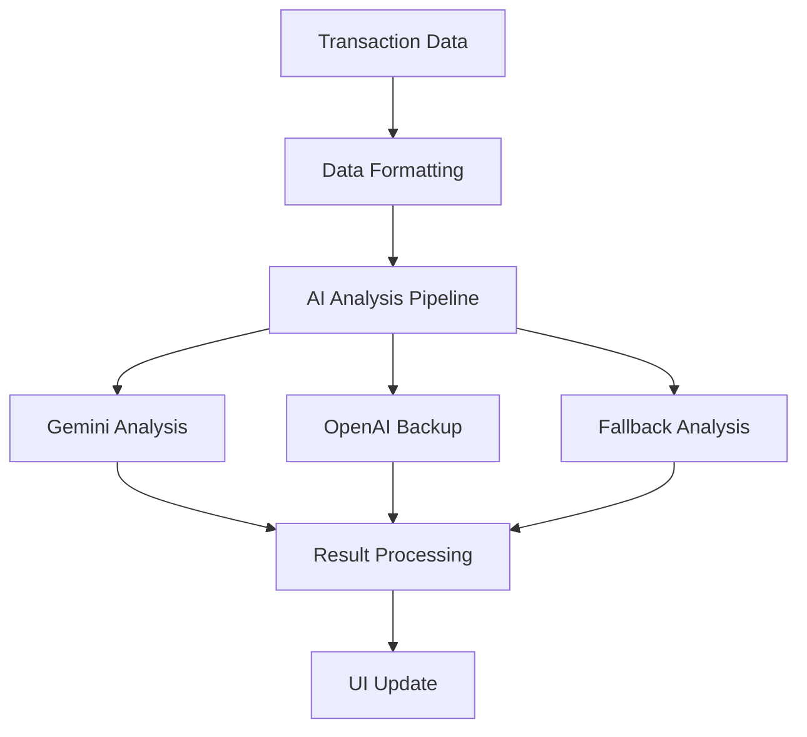

# AI Solana Wallet Analyzer

## Introduction
The Solana Wallet Analysis tool is a comprehensive web application that provides in-depth analysis of Solana blockchain wallets. It combines real-time blockchain data, historical analysis, and AI-powered insights to give users a complete view of wallet activity and portfolio composition.

### Key Features
- Real-time wallet balance tracking
- Historical transaction analysis
- Token portfolio visualization
- AI-powered trading pattern analysis
- Interactive data visualizations
- Multi-provider data reliability
- Responsive and modern UI

## Getting Started

### Prerequisites
- Node.js (v16 or higher)
- npm or yarn package manager
- Git for version control
- Required API Keys:
  - Solana RPC endpoint (Alchemy API key)
  - Moralis API key for token data
  - OpenAI API key (optional for AI analysis)
  - Gemini API key (optional for AI analysis)

### Installation

1. Clone the repository:
```bash
git clone https://github.com/skynette/solana-wallet-analyzer.git
cd solana-wallet-analyzer
```

2. Install dependencies:
```bash
npm install
# or
yarn install
```

3. Set up environment variables in `.env.local`:
```env
NEXT_PUBLIC_ALCHEMY_API_KEY=your_alchemy_key
NEXT_PUBLIC_MORALIS_API_KEY=your_moralis_key
OPENAI_API_KEY=your_openai_key
GEMINI_API_KEY=your_gemini_key
```

4. Start the development server:
```bash
npm run dev
# or
yarn dev
```

5. Build for production:
```bash
npm run build
# or
yarn build
```

## Architecture

### Overview
The application is built using Next.js 13+ with the App Router, featuring a modern, component-based architecture that emphasizes:

1. **Server-Side Components**
   - Optimized data fetching
   - Improved SEO capabilities
   - Reduced client-side JavaScript

2. **Client-Side Interactivity**
   - Real-time updates
   - Responsive UI components
   - Seamless user experience

3. **Data Layer**
   - Multiple data providers
   - Fallback mechanisms
   - Caching strategies

### Technical Stack

#### Frontend
- Next.js 13+ (React framework)
- Tailwind CSS (Styling)
- Framer Motion (Animations)
- Recharts (Data visualization)
- shadcn/ui (UI components)

#### Backend
- Next.js API Routes
- Solana Web3.js
- Moralis SDK
- AI Integration (Gemini & OpenAI)

#### Infrastructure
- Vercel (Recommended deployment)
- Edge Functions support
- API Route handlers

### Core Components

#### Page Components

1. **WalletSearch Page (`src/app/wallet/[address]/page.tsx`)**
```typescript
'use client';
import { useParams } from 'next/navigation';
// ... component code
```
- Handles dynamic routing
- Manages URL parameters
- Controls layout structure

2. **WalletSearch Component**
```typescript
interface WalletSearchProps {
    initialAddress?: string;
}
// ... component implementation
```
- Core functionality wrapper
- State management
- Data fetching orchestration

#### Data Visualization Components

1. **Balance Card**
- Displays current SOL balance
- Shows value in USD
- Animated updates

2. **Line Chart**
- Historical balance tracking
- Interactive tooltips
- Time-based filtering

3. **Pie Chart**
- Token distribution
- Interactive segments
- Percentage calculations

4. **Transaction Table**
- Paginated transaction history
- Sortable columns
- Transaction details

### Data Flow

1. **Initial Load**


2. **Analysis Process**


## API Reference

### Endpoints

#### 1. Transaction Analysis
```typescript
POST /api/analyze
```

**Request Body:**
```typescript
{
    transactions: Transaction[];
    tokens: Token[];
    address: string;
}
```

**Response:**
```typescript
{
    analysis: {
        text: string;
        metrics?: {
            riskScore: number;
            tradingFrequency: string;
            portfolioDiversity: string;
        };
    }
}
```

#### 2. Token Data
```typescript
GET /api/tokens/:address
```

**Response:**
```typescript
{
    tokens: {
        mint: string;
        amount: number;
        decimals: number;
        price?: number;
        name?: string;
        symbol?: string;
    }[];
}
```

### Error Handling
All API endpoints follow a consistent error response format:
```typescript
{
    error: string;
    code?: string;
    details?: unknown;
}
```

## Component Documentation

### WalletSearch

```typescript
import WalletSearch from '@/components/WalletSearch';

// Usage
<WalletSearch initialAddress="optional-address" />
```

**Props:**
- `initialAddress?: string` - Optional initial wallet address

**State:**
- `address: string` - Current wallet address
- `balance: number | null` - Current SOL balance
- `transactions: Transaction[]` - Transaction history
- `tokens: Token[]` - Token holdings
- `loading: boolean` - Loading state
- `error: string | null` - Error state

### BalanceCard

```typescript
import BalanceCard from '@/components/balanceCard';

// Usage
<BalanceCard SOLBalance={balance} />
```

**Props:**
- `SOLBalance: number` - SOL balance to display

### TransactionTable

```typescript
import TransactionTable from '@/components/transactions/transaction-table';

// Usage
<TransactionTable 
    transactions={transactions}
    address={address}
/>
```

**Props:**
- `transactions: Transaction[]` - Array of transactions
- `address: string` - Wallet address

## Contributing

### Development Setup

1. Fork the repository
2. Create a new branch:
```bash
git checkout -b feature/your-feature-name
```

3. Enable pre-commit hooks:
```bash
npm run prepare
# or
yarn prepare
```

### Coding Standards

1. **TypeScript**
- Strict type checking enabled
- Interface over type where possible
- Proper error handling
- Comprehensive type definitions

2. **React Best Practices**
- Functional components
- Custom hooks for logic separation
- Proper use of useEffect and dependencies
- Memoization where appropriate

3. **Testing**
- Jest for unit tests
- React Testing Library for component tests
- E2E tests with Cypress

### Pull Request Process

1. Update documentation
2. Add/update tests
3. Ensure CI passes
4. Request review from maintainers

### Code Review Guidelines

- Focus on:
  - Type safety
  - Performance
  - Security
  - Code clarity
  - Test coverage

## Deployment

### Vercel Deployment (Recommended)

1. Connect your repository to Vercel
2. Configure environment variables
3. Deploy with:
```bash
vercel --prod
```

### Manual Deployment

1. Build the application:
```bash
npm run build
# or
yarn build
```

2. Start the production server:
```bash
npm start
# or
yarn start
```

### Environment Configuration

Required environment variables:
```env
# Required
NEXT_PUBLIC_ALCHEMY_API_KEY=
NEXT_PUBLIC_MORALIS_API_KEY=

# Optional (for AI features)
OPENAI_API_KEY=
GEMINI_API_KEY=
```

### Monitoring and Maintenance

1. **Performance Monitoring**
- Vercel Analytics
- Custom metric tracking
- Error logging

2. **Updates and Maintenance**
- Regular dependency updates
- Security patches
- Performance optimizations

### Security Considerations

1. **API Key Protection**
- Use environment variables
- Implement rate limiting
- Add request validation

2. **Data Safety**
- No private key handling
- Public data only
- Secure API endpoints

This completes the comprehensive documentation for the Solana Wallet Analysis tool. For additional support or questions, please open an issue in the repository.